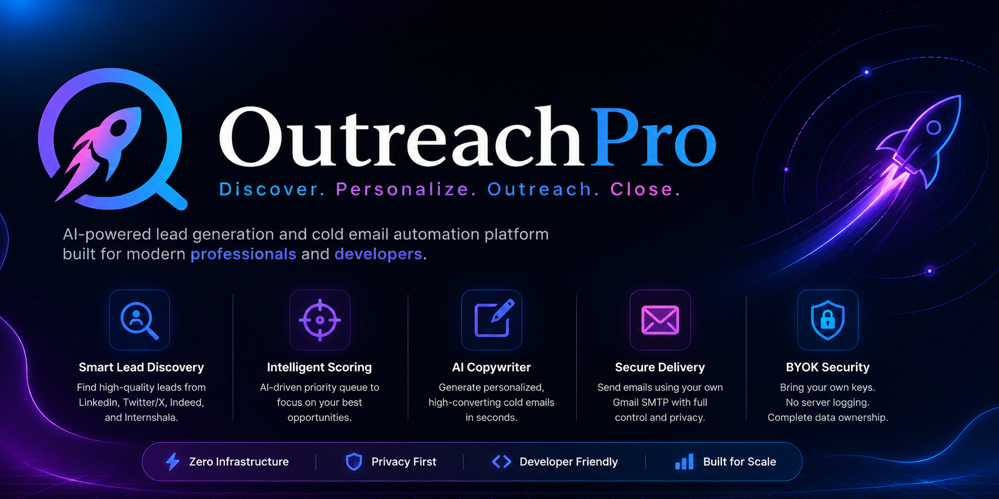

<p align="center">
  
</p>

<br/>

<h1 align="center">OutreachPro 🚀</h1>

<p align="center">
  <em>AI-powered lead generation and cold email automation platform built for modern professionals and developers.</em>
</p>

<p align="center">
  <a href="https://in.linkedin.com/in/rudraksh-singh-khichi-866099324">
    
  </a>
  <a href="https://github.com/RealRudraksh">
    
  </a>
  <a href="https://www.instagram.com/_realrudraksh_">
    
  </a>
</p>

---

**OutreachPro** is a modern, zero-infrastructure cold email and automated lead generation platform designed for full-stack developers, creators, and professionals. By eliminating complex server management and utilizing a decentralized **Bring Your Own Key (BYOK)** model, the platform allows you to scrape highly targeted leads across multiple platforms, personalize communications instantly using a smart AI copywriter, and securely queue delivery via your own Gmail SMTP pipeline.

---

## ✨ Key Features

* **Platform X-Ray Engine:** Scrape, parse, and filter high-value leads dynamically across major networks, including **LinkedIn, Twitter/X, Indeed, and Internshala**.
* **Global Horizon Multi-Page Pooling:** Queries up to 60 search result indices across multiple pagination layers simultaneously, assembling a comprehensive target landscape before filtering.
* **Intelligent Lead Scoring Queue:** Implements an automated priority queue algorithm that scores lead profiles based on cumulative keyword depth (e.g., matching tech stacks) and active recruitment intent markers (e.g., *HR Manager*, *Talent Acquisition*, *Recruiter*), sorting the highest-quality leads to the top.
* **Smart Anti-Spam Exclusion Gates:** Automatically identifies and drops generic corporate proxy email nodes (like `support@`, `info@`, `help@`) on the fly, dynamically rolling over to the next high-intent human target in the sample pool.
* **Dynamic Deduplication Tracker:** Utilizes client-side cache signatures to log successfully messaged links, preventing duplicate outreach on subsequent runs and maximizing data utilization.
* **Smart AI Copywriter:** Features an integrated Google Gemini LLM prompting interface right inside your dashboard to break writer's block and compose high-converting cold email blueprints on the fly.
* **Multipart File Streaming:** Integrated with automated server-side RAM stream buffers to handle real-time binary uploads of assets like PDF resumes or slide decks without local server storage overhead.
* **SaaS Security & Domain Guardrails:** Built-in delivery restrictions and a visual limit slider prevent sequential mass-mailing slips, keeping your personal domain safe from Google blacklists.
* **BYOK Architecture:** Zero server logging or credential risks — bring your own SerpAPI token and a secure, 16-character Google App Password to maintain complete decentralized custody of your pipeline.
* **Premium Glassmorphic Workspace:** Designed with a smooth, responsive, wide-view dark UI complete with fluid layout wrappers, animated progress indicators, and interactive credential guides.

---

## 🛠️ Tech Stack

### Frontend
* **React.js** (Functional Components, Initial State Caching & Performance Hooks)
* **Tailwind CSS v4** (Modern unified, CSS-first glassmorphic layout framework)
* **Vite** (Next-generation lightning-fast build tool)

### Backend
* **Node.js with Express** (Fast, un-opinionated full-stack server middleware architecture)
* **Multer** (Stream buffer management for dynamic multi-part form file attachments)
* **SerpAPI** (Google Search engine orchestration & parsing layer)
* **Nodemailer** (Secure transport configuration protocol for direct SMTP client relay)
* **Google Gen AI SDK** (Direct integration with Gemini 2.5 Flash for contextual copywriting)

---

## 📦 Project Architecture

```text
OutreachPro/
├── frontend/               # React single-page dashboard application
│   ├── public/             # Static file directory (branding logos, avatars)
│   ├── src/
│   │   ├── App.jsx         # Main interaction state architecture & UI engine
│   │   ├── main.jsx        # React DOM client mount layer
│   │   └── index.css       # Tailwind v4 utility configuration & custom animations
│   ├── vite.config.js      # Bundler config handling compilation assets
│   └── package.json        # Client-side dependency tree
└── backend/
    ├── index.js            # Express routing, global horizon pooling & scraping logic
    └── secure.env          # Local secret keys & tokens sandbox (git-ignored)
```

---

## 🎯 Use Cases

* **Internship Hunting:** Automatically discover active tech recruiters and apply with personalized messages and attached resumes in seconds.
* **Job Applications:** Target and sequence cold outreach directly to startup decision-makers.
* **Freelance Client Outreach:** Tap into multi-platform network feeds to find prospects looking for immediate engineering help.
* **Startup Lead Generation:** Accelerate user acquisition and client prospecting loops without expensive B2B database subscriptions.
* **Recruitment Prospecting:** Build targeted pipelines for HR and talent acquisition workflows at scale.

---

## 🚀 Quick Start (Local Setup)

### 1. Clone the repository

```bash
git clone https://github.com/RealRudraksh/OutreachPro.git
cd OutreachPro
```

### 2. Configure Backend Tokens

Navigate to the backend directory, create a `secure.env` file, and input your API tokens:

```bash
cd backend
echo "GEMINI_API_KEY=your_gemini_key_here" > secure.env
npm install
node index.js
```

### 3. Spin Up Frontend Development Environment

Open a second terminal, navigate to the frontend directory, and launch the client:

```bash
cd frontend
npm install
npm run dev
```

Open your browser at the port link shown in your terminal (usually `http://localhost:5173/`).

---

## 👨‍💻 Developer Profile

Built with ⚡ by **Rudraksh Singh Khichi** *(Full-Stack Automation Engineer)*

<p>
  <a href="https://in.linkedin.com/in/rudraksh-singh-khichi-866099324">
    
  </a>
  <a href="https://github.com/RealRudraksh">
    
  </a>
  <a href="https://www.instagram.com/_realrudraksh_">
    
  </a>
</p>

Feel free to connect on my active channels! 🤝
